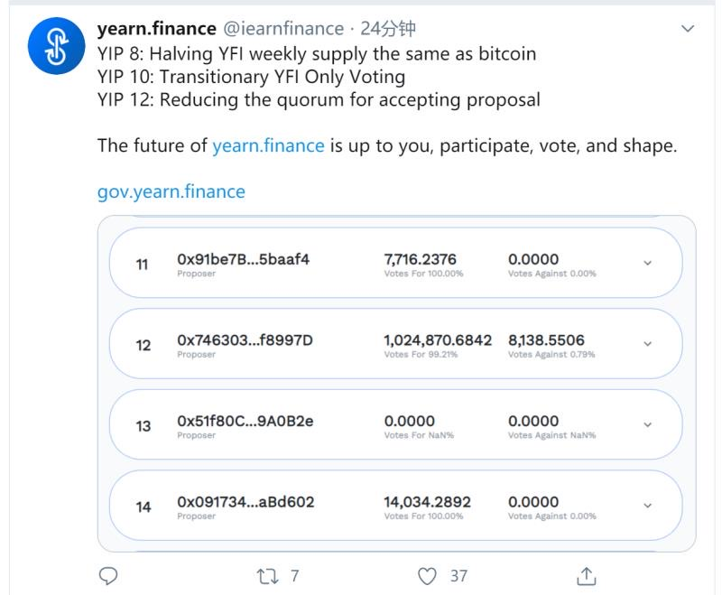
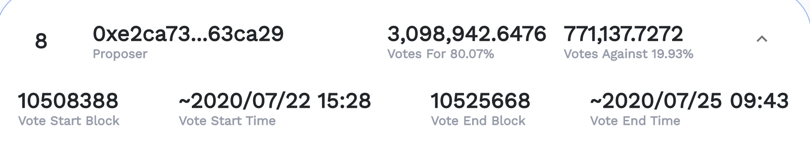
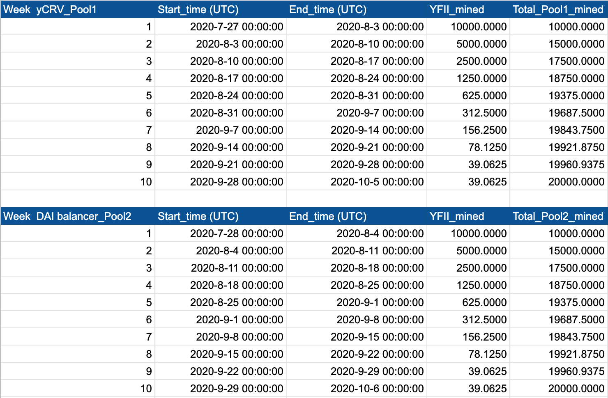
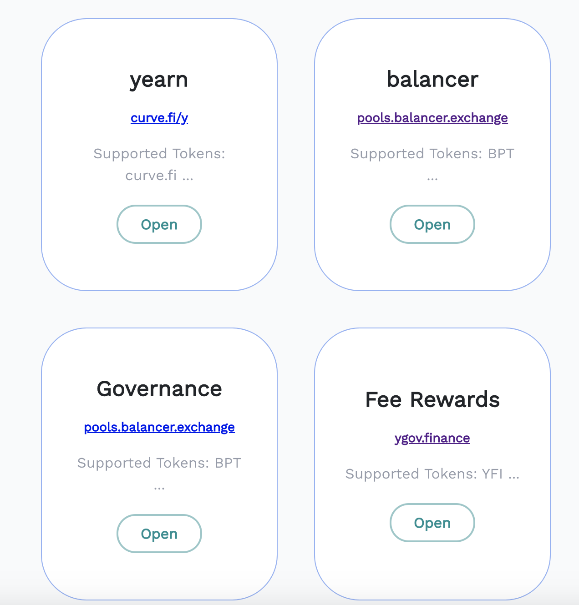
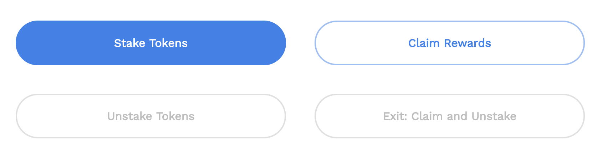
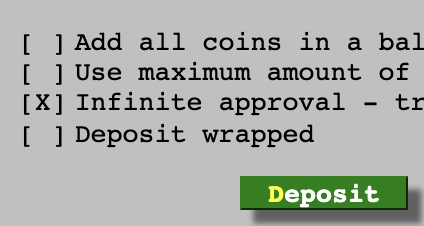
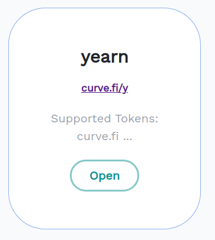
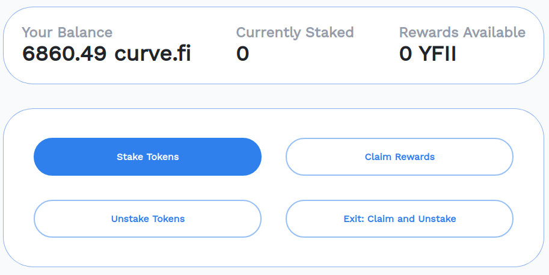
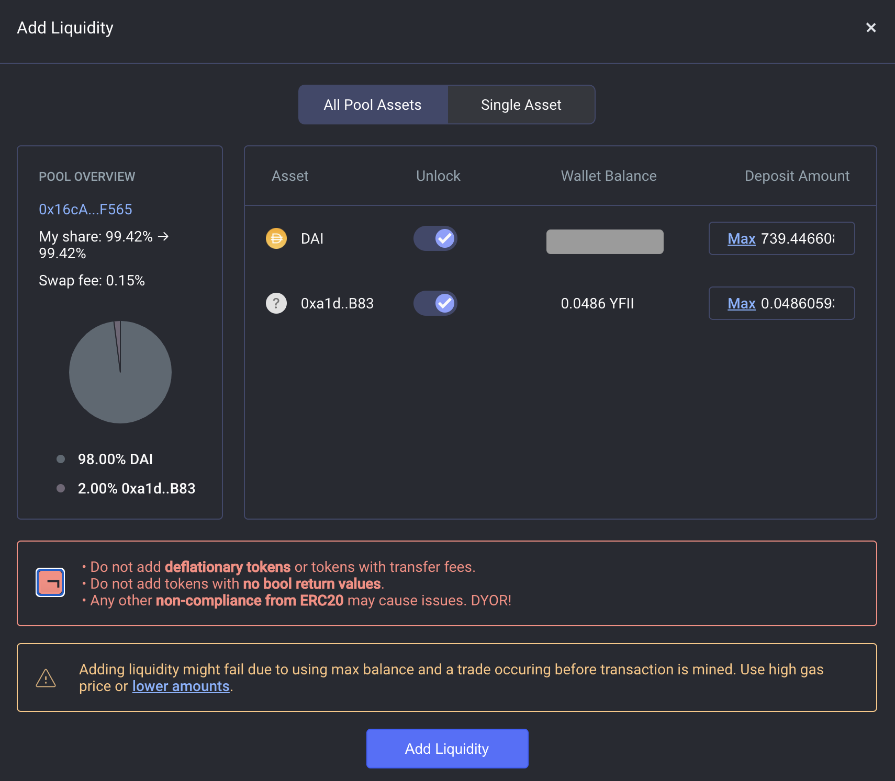
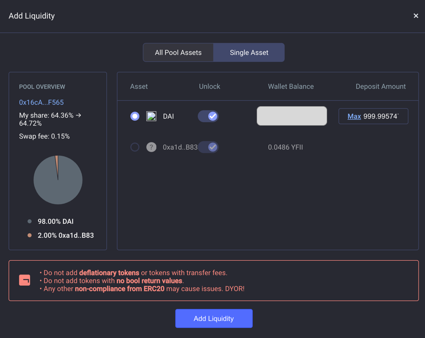

# YFII: An innovative DeFi farm field

by YFII Global Community

**TLDR: YFII is a fork of YFI project with YIP-8 implementation**

---

## What is Yearn, and What is YFI?

Yearn is a yield aggregator for DeFi lending platforms that rebalances for highest yield during contract interaction which supports Compound, dYdX, Aave and DDEX protocols. When users put their money into the platform, it automatically transfers the assets into the protocol that has the highest yield, and returns a proof of stake called yToken. Users can send back yTokens at any time to withdraw their deposits along with the interest.

Moreover, Yearn and Curve together created y.curve.fi, a pool for stable coin exchange. Besides enjoying the interest on lending, yToken holders can put their tokens into the exchange pool of y.curve.fi to become a market maker, generating extra incomes. Such a combo now ranks first among all DeFi platforms by APR.

(Andre Cronje)

YFI is the token used for governing Yearn protocol. Its initiator Andre Cronje admitted that he had no interest in participating in the governance and wished the community to be autonomously organized. Until July 26th, YFI has been issued to yield farmers who provide liquidity to the pools (Info from debank.com).

---

## What is YIP-8, and why has YFI been forked?

As mentioned above, the mining/farming of YFI has stopped on July 26. In order to prevent a sharp drop in liquidity of the pools, the community proposed YIP-8, suggesting a weekly halving model for yield farming. Though more than 80% of the votes are FOR the proposal, it has been declined because of the unmet 33% quorum requirement. To protect Andre's genius design from being spoilt by whales, we forked YFI, naming it YFII. The issuance of YFII imitates the halving model of Bitcoin so that the tokens will be fairly distributed to the community.

(Yearn Improvement Proposal 8)

(FOR votes of YIP-8 exceed 80.07% but the proposal is still declined due to early farming whales' intervention)

---

## Token design of YFII 

The total supply of YFII is **40,000**. Each of the two pools will be emitting 20,000 tokens to yield farmers, starting at 10,000 in the first week **halving every 7 days**. The number of tokens farmed is in proportion to the liquidity farmers provide to the pools. YFII will be completely distributed in the following 10 weeks.

---

## Can the developers issue infinite number of YFII tokens to steal my money?

**No, they can't.** The minting key has already been burnt by transferring the admin role to the blackhole address (0x00) so that no one has this privilege to mint new tokens. You can examine the burning txns [here](https://burn.yfii.finance/).

---

## What yields can you farm by providing liquidity to YFII pools?

- Pool 1: YFII and CRV (governance token of curve.fi platform); open when YFII's launched;
- Pool 2: YFII and BAL (governance token of Balancer, available when whitelisted); open on the second day of genesis;
- Pool 3: Stake YFII and its derivatives to earn interest on evolving DeFi assets; *in open discussion*;
- ...
- Pool N: Integrating more business from YFI and innovating YFII's own.

---

## How to get YFII, and when will it be launched?

**YFII belongs to the community. No pre-mining. No ICO. No dev team rewards.** The only way to get YFII is to provide liquidity to the pools. YFII is the token for community governance and the key to farming yields of various DeFi platforms. It is used for revenue allocation and voting in the YFII DAO.

- **Time of the YFII Genesis**: UTC 16:00 July 27, 2020
- **Pool 1 opening**: UTC 16:00 July 27, 2020
- **Pool 2 opening**: UTC 16:00 July 28, 2020

---

## How to participate?

### **Pool 1**

If you are farming YFI, exit from YFI Pool 3 and withdraw BPT. Go to Balancer and remove liquidity to get back yCRV and YFI. You'll need yCRV to farm YFII. Below are the detailed instructions.

1. Visit https://ygov.finance/staking and connect to Metamask. Open **Governance** (Pool 3).

2. Click **Exit: Claim and Unstake** to withdraw your staked BPT and rewards.

> Note: If you ever voted, your stake will be locked for 3 days before you can unstake.

3. Go to [yCRV/YFI pool on Balancer](https://pools.balancer.exchange/#/pool/0x95C4B6C7CfF608c0CA048df8b81a484aA377172B). Choose **Max** under **All Pool Assets** and then click **Remove Liquidity** to get back your yCRV and YFI.

If you have never farmed YFI and this is the first time you farm YFII, go to the [Y pool on Curve](https://www.curve.fi/iearn/deposit) and deposit any one or any combination of USDT/DAI/USDC/TUSD to get yCRV. Don't click on other buttons other than Deposit because they may cost you extra gas.

Now you have yCRV in your wallet and are ready to farm YFII. Go to https://yfii.finance and click **Stake**. Open the **yearn** pool (Pool 1).

Click **Stake** and Metamask will ask you to authorize two transactions (one for permission to spend and the other for staking).

### **Pool 2**

1. You need DAI in your wallet before farming. Stake assets in Maker to borrow DAI or go to your favourite exchange to buy DAI.

2. Go to the [DAI-YFII balancer pool](https://pools.balancer.exchange/#/pool/0x16cAC1403377978644e78769Daa49d8f6B6CF565) and setup **Balancer Proxy** first.

   a) If you have YFII, choose **All Pool Assets**.
Unlock **DAI** and **YFII** (0xa1d0E215a23d7030842FC67cE582a6aFa3CCaB83) by sending two transactions and then they become unlocked. Input the amount you are going to deposit in either box of DAI or YFII, and the page will input the corresponding amount of the other for you. Click **Add Liquidity** to send a transaction and then you get BPT.

   

   b) If you don't have YFII, choose **Single Asset**. Unlock **DAI** and input your deposit amount. Then click **Add Liquidity**. The system will buy the corresponding amount of YFII needed for you and then you get BPT.

   

3. Go to https://yfii.finance and click **Stake**. Open the **balancer** pool (Pool 2) and you'll see your BPT amount. Stake BPT to begin farming YFII.

---

## Where to trade YFII?

Go to [Balancer](https://balancer.exchange/#/swap). Choose **DAI** at one side and choose **YFII** (paste in the contract address 0xa1d0E215a23d7030842FC67cE582a6aFa3CCaB83) at the other side to trade. Please keep an eye on the price slippage when it's in the early stage.

---

## Contract Addresses:

**YFII Pool 1**: 0xb81D3cB2708530ea990a287142b82D058725C092

**YFII Pool 2**: 0xAFfcD3D45cEF58B1DfA773463824c6F6bB0Dc13a

**YFII Token**: 0xa1d0E215a23d7030842FC67cE582a6aFa3CCaB83

**BPT Token**: 0x16cAC1403377978644e78769Daa49d8f6B6CF565

---

## Warning: 

This project is still in **Beta** and the smart contract has not been audited. Please **use at your own risk**.

**Note**: YFII has zero financial value.

---

## Community

**Twitter**: https://twitter.com/FinanceYfii

**Telegram**: https://t.me/yfiifinance

**Discord**: https://discord.gg/vXPHyz7

**WeChat**: myGrassU